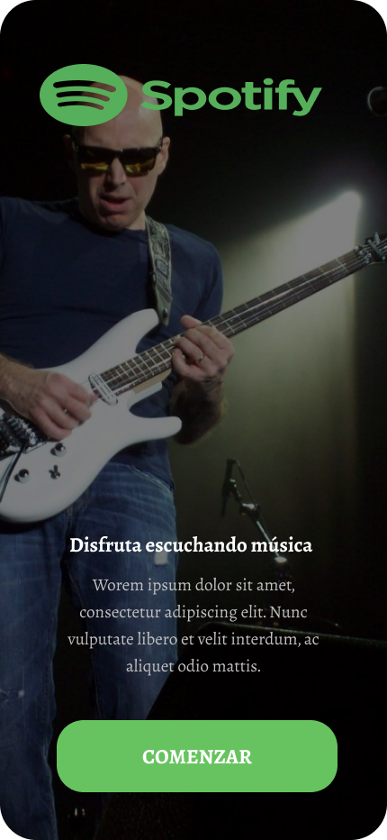
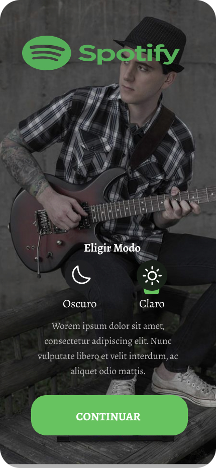
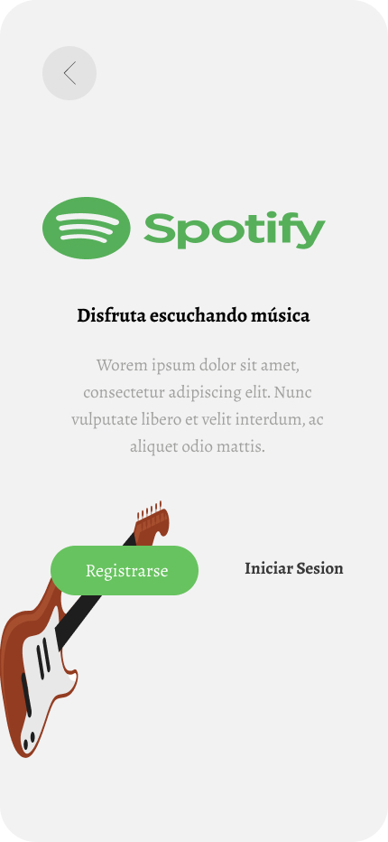
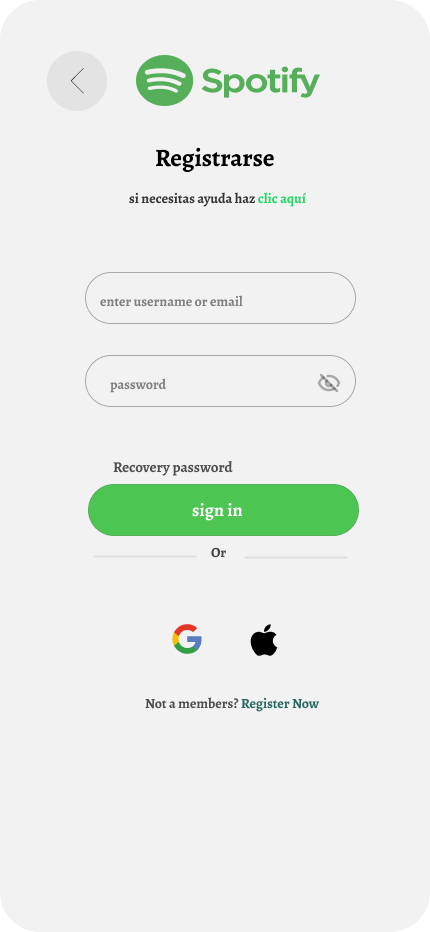
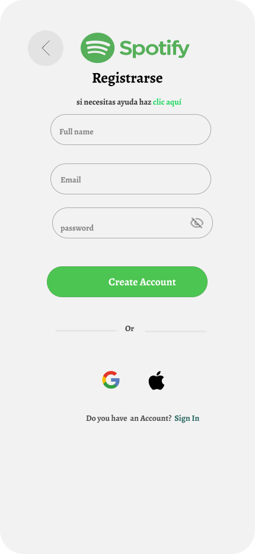
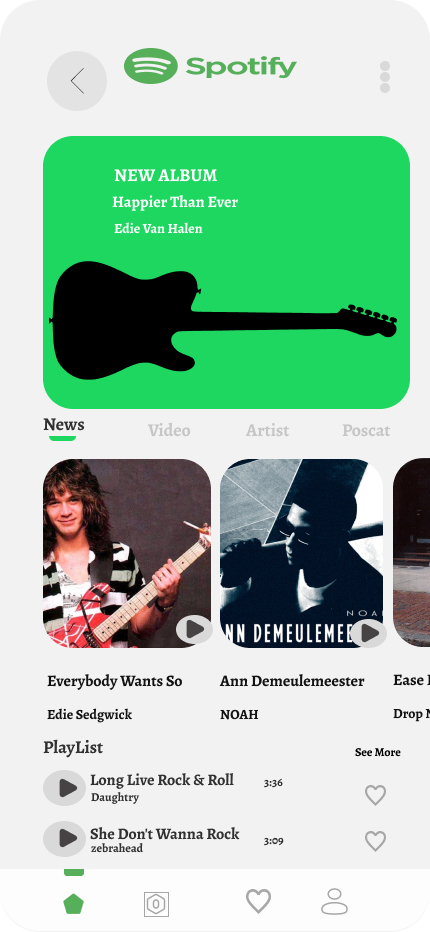
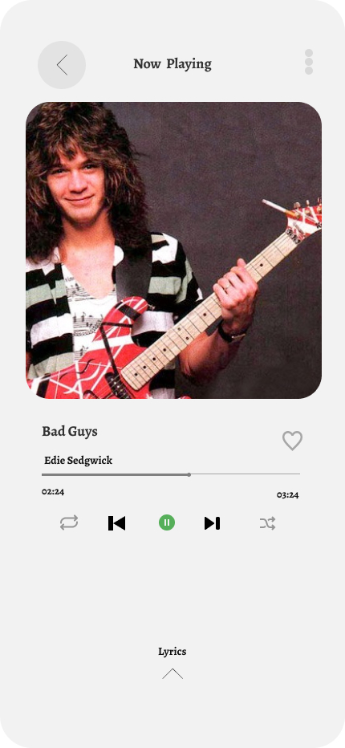
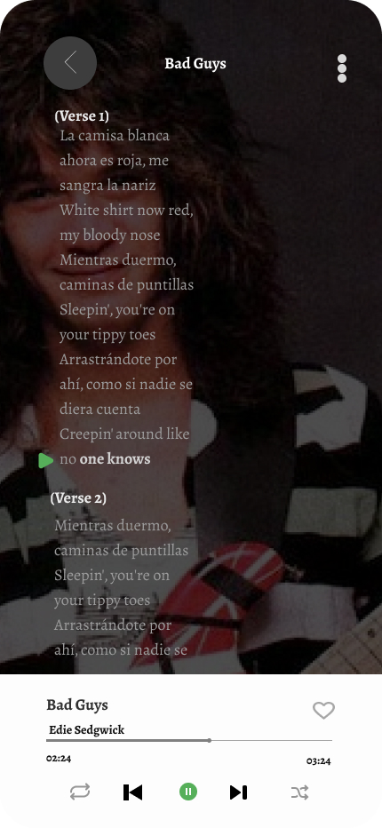
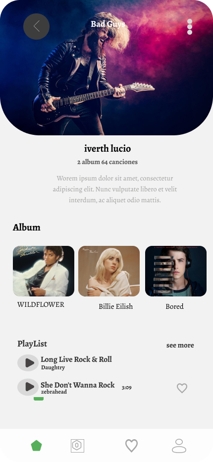
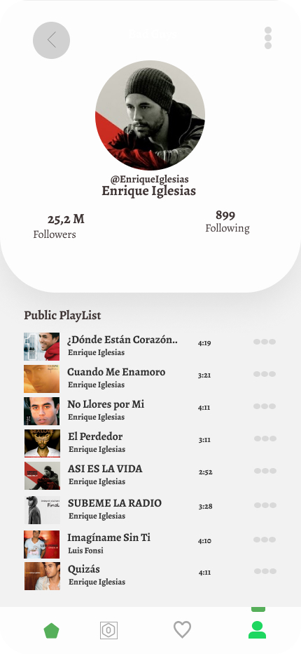

# Diseño de SPOTIFY realizado en Figma
## Se visualiza el inicio de Spotify
### La imagen es una publicidad de Spotify en español. Muestra a un hombre calvo tocando una guitarra eléctrica blanca. En la parte superior izquierda se encuentra el logo de Spotify y la palabra "Spotify". Debajo del hombre hay un texto que dice "Disfruta escuchando música" y un párrafo de texto adicional. En la parte inferior, un botón verde dice "COMENZAR".
 
## Seleccionar el modo y click en boton continuar
### La imagen muestra una interfaz de Spotify en español con un hombre joven tocando una guitarra eléctrica. En la parte superior izquierda se encuentra el logo y el nombre "Spotify". Debajo del hombre, hay una sección para "Elegir Modo" con opciones para "Oscuro" (con un icono de luna) y "Claro" (con un icono de sol). Debajo de estas opciones hay un texto de relleno y un botón verde en la parte inferior que dice "CONTINUAR".

## click en Iniciar Sesión
### La imagen es una interfaz de inicio de sesión de Spotify en español. En la parte superior izquierda hay un botón para retroceder. Centrado en la parte superior se encuentra el logo de Spotify y la palabra "Spotify". Debajo, el texto "Disfruta escuchando música" está acompañado de un párrafo de texto de relleno. En la parte inferior izquierda, superpuesta sobre una ilustración de una guitarra eléctrica, hay un botón verde que dice "Registrarse". A la derecha de este botón se encuentra el texto "Iniciar Sesion".

## Click en Register Now
### La imagen muestra una pantalla de "Registrarse" o "Iniciar sesión" de Spotify en español. En la parte superior izquierda hay un botón para retroceder. Centrado en la parte superior se encuentra el logo de Spotify y la palabra "Spotify", seguido del título "Registrarse" y un enlace de ayuda. Hay dos campos de texto para ingresar el "nombre de usuario o correo electrónico" y la "contraseña", con una opción para mostrar u ocultar la contraseña. Debajo, hay un enlace para "Recovery password" y un botón verde para "sign in". Alternativamente, se ofrece la opción de iniciar sesión con Google o Apple. Finalmente, en la parte inferior, hay un enlace que pregunta "¿No eres miembro? Regístrate ahora".
 
## Completar todo los campos (gmail,usuario y contraseña)
### La imagen muestra una pantalla de registro de Spotify en español. En la esquina superior izquierda hay un botón para retroceder. Centrado en la parte superior se encuentra el logo de Spotify y la palabra "Spotify", seguido del título "Registrarse" y un enlace de ayuda. Hay tres campos de texto para ingresar el "Nombre completo", "Email" y "Contraseña", con una opción para mostrar u ocultar la contraseña. Debajo, hay un botón verde para "Create Account". Alternativamente, se ofrece la opción de registrarse con Google o Apple. Finalmente, en la parte inferior, hay una pregunta "¿Do you have an Account?" con un enlace para "Sign In".
 
## Accediste con tu usuario y Contraseña
### La imagen muestra una interfaz de la aplicación Spotify con un anuncio de un nuevo álbum de "Edie Van Halen" y varias opciones de contenido como noticias, videos y artistas. También se visualizan algunas canciones en una lista de reproducción y una barra de navegación inferior con diferentes secciones de la aplicación.
 
## Se visualiza el corrido de la música Bad Guys
### La imagen muestra la pantalla de "Now Playing" de una aplicación de música. Se visualiza la carátula de una canción con una fotografía de Eddie Van Halen tocando una guitarra roja y blanca. El título de la canción es "Bad Guys" y el artista es "Edie Sedgwick". Se muestra la duración de la canción (02:24 de 03:24) junto con controles de reproducción como repetir, anterior, pausa/reproducir, siguiente y aleatorio. También hay un icono de corazón para indicar "me gusta" y una opción para ver la letra de la canción.
 
## Se visualiza la cancion Bad Guys con letra
### La imagen muestra la letra de la canción "Bad Guys" de Edie Sedgwick que se está reproduciendo en una interfaz de usuario, probablemente una aplicación de música como Spotify.

#### Se puede ver:

#### El título de la canción: Bad Guys
#### El nombre del artista: Edie Sedgwick

## Se puede elegir otro tipo de género 
### La imagen muestra una interfaz de usuario de una aplicación de música. En la parte superior, se ve la portada de la canción "Bad Guys" con un guitarrista tocando. Debajo, se indica que el artista es "iverth lucio" con 2 álbumes y 64 canciones. Hay una sección de "Album" que muestra tres portadas de álbumes, incluyendo uno con la leyenda "Billie Eilish". Finalmente, hay una sección de "PlayList" con dos canciones listadas.

 
## Se muestra el genero de Enrique Iglesias
### La imagen muestra el perfil de Enrique Iglesias en una plataforma de música (posiblemente Spotify). Se visualiza su foto de perfil, nombre de usuario (@EnriqueIglesias), su nombre, el número de seguidores (25.2 millones) y a cuántas personas sigue (899). Debajo, se presenta una lista de reproducción pública con varias de sus canciones, incluyendo "¿Dónde Están Corazón...?", "Cuando Me Enamoro", "No Llores por Mí", "El Perdedor", "ASI ES LA VIDA", "SUBEME LA RADIO", "Imagíname Sin Ti" (con Luis Fonsi), y "Quizás". Se indica la duración de cada canción.

